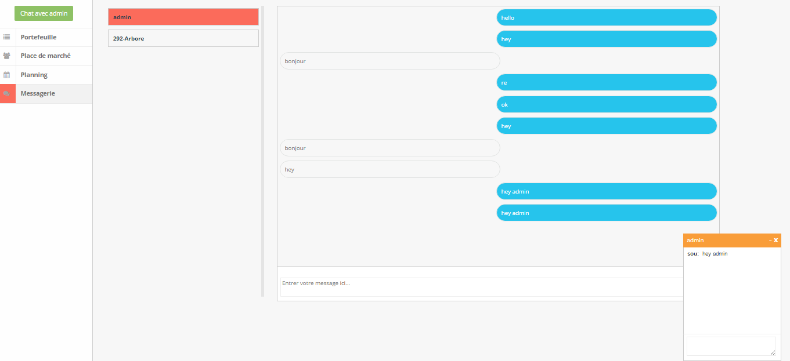
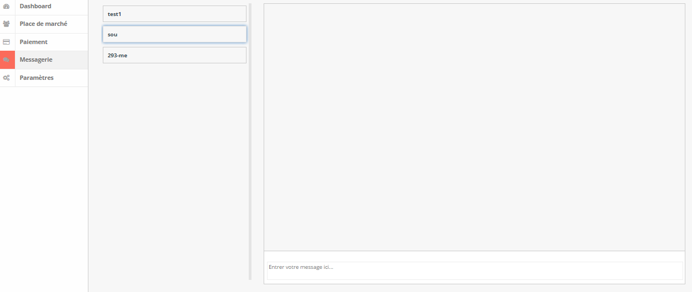
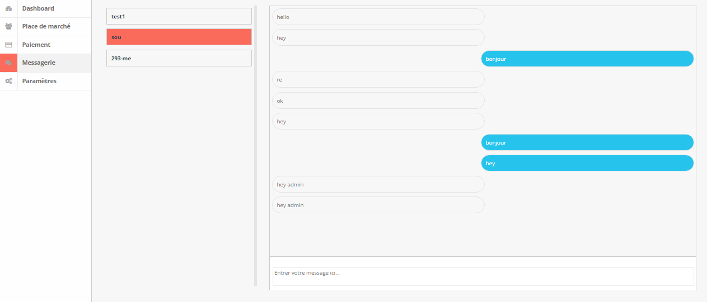

# Messagerie

Système de messagerie "Chat" en temps réel, en utilisant une base de donnée MySQL.

### Configuration

Utilisez le fichier chat.sql pour créer votre base et la remplir pour commencer les tests.

```
```

Changer le ID et PASSWORD selon votre serveur dans tout les fichiers chat, affiche, msg

### Example
```
Client
```


```
Admin 1
```


```
Admin 2
```
